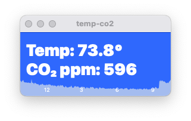

# co2
macOS software for the CO2Meter.com CO₂ meter

## Contents

There are three macOS programs here:

**co2Tiny** - a minimal command line app that just connects via USB to a CO2meter.com  and writes the temperature and CO₂ level to the command line.

**CO₂** - a more full featured command line app

**temp-co2** - a traditional macOS app that displays the current temperature and CO₂ in a window.

## To build

The command line tools can be built by `cd`ing to their directory and running `make`

Or, you can open the `CO₂.xcodeproj` with Xcode, set your development team, and select each target and make it.

For temp-co2, open  `temp-co2.xcodeproj` with Xcode, set your development team, and bundle ID, and build it.

## License

Apache license version 2
